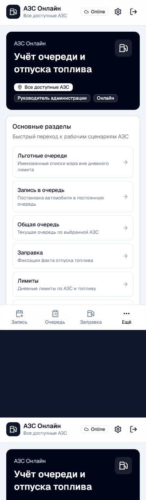
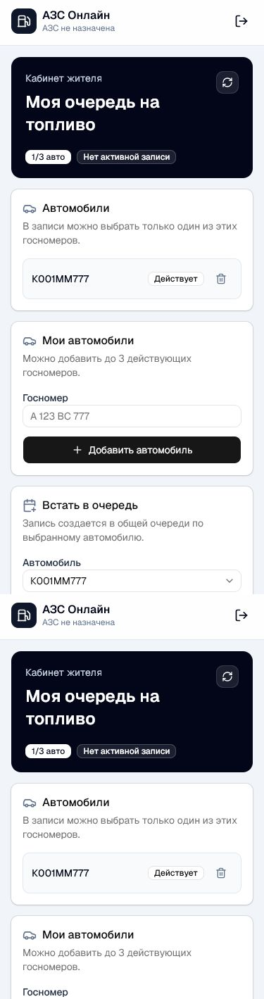
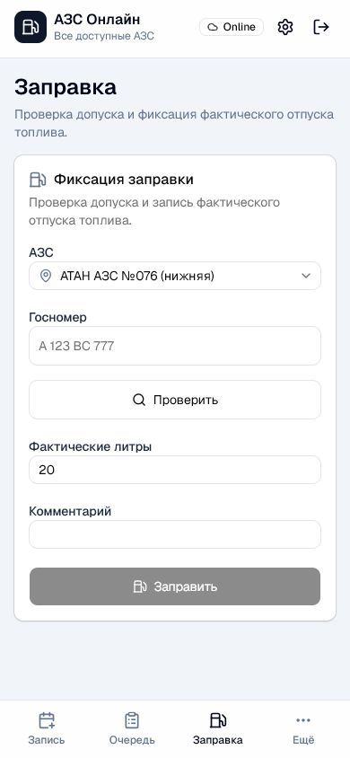
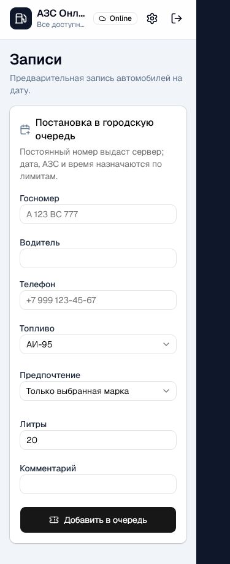
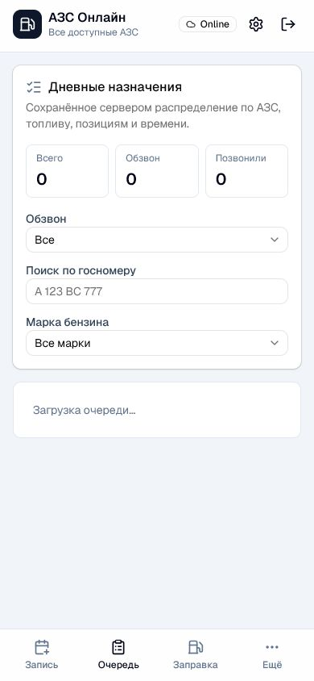
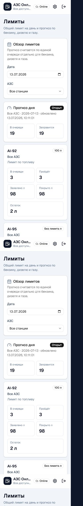
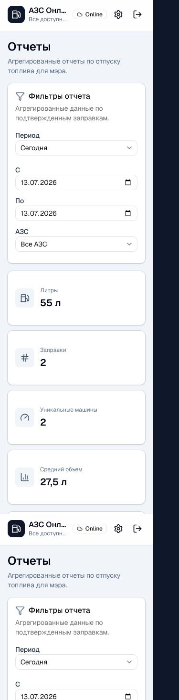
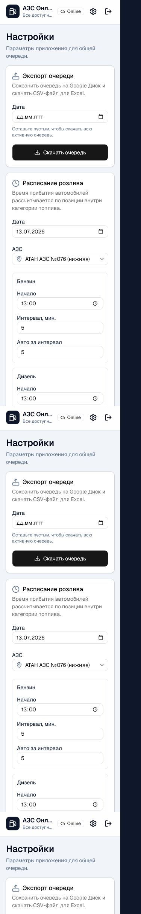

# АЗС Онлайн: краткая методичка по ролям

Методичка помогает быстро понять, что делать в приложении в обычных рабочих ситуациях. Пользуйтесь приложением с телефона: нижнее меню ведет в основные разделы `Запись`, `Очередь`, `Заправка`, `Ещё`.

## Общие правила

1. Откройте приложение и войдите под своей учетной записью.
2. Проверьте, что вверху указана нужная АЗС или доступ ко всем АЗС.
3. Работайте только в разделах, которые доступны вашей роли.
4. Если раздел не открывается, обратитесь к руководителю или администратору доступа.
5. Если форма показывает ошибку, исправьте выделенное поле и повторите действие.

## Пользователь / житель

Когда использовать: нужно добавить свой автомобиль, встать в очередь, посмотреть статус записи или отменить запись, пока она еще доступна для отмены.

Что делать:

1. Войдите в личный кабинет.
2. В блоке `Автомобили` проверьте добавленные госномера.
3. Если нужного номера нет, введите госномер и нажмите `Добавить автомобиль`.
4. В блоке `Встать в очередь` выберите автомобиль, топливо и проверьте телефон.
5. Нажмите `Создать запись`.
6. Если появилась активная запись, следите за статусом, номером в очереди и назначенной АЗС.
7. Если запись больше не нужна и кнопка отмены доступна, нажмите `Отменить запись`.

В каких случаях обращаться к сотруднику: запись уже взята в работу, отмена недоступна, номер не добавляется, данные отображаются неверно.

## Кассир АЗС

Когда использовать: автомобиль приехал на АЗС, нужно проверить допуск и зафиксировать фактический отпуск топлива.

Что делать при заправке:

1. Откройте раздел `Заправка`.
2. Проверьте выбранную АЗС.
3. Введите госномер автомобиля.
4. Нажмите `Проверить`.
5. Если доступ разрешен, укажите фактические литры.
6. При необходимости добавьте короткий комментарий.
7. Нажмите `Заправить` только после фактического отпуска топлива.

Если доступ запрещен: не заправляйте автомобиль через приложение. Сообщите водителю причину на экране и при необходимости передайте вопрос управляющему.

## Админ / помощник

Когда использовать: нужно поставить автомобиль в очередь, смотреть текущую очередь и помогать с рабочими ситуациями по записи.

Что делать при записи автомобиля:

1. Откройте раздел `Запись`.
2. Введите госномер.
3. Выберите дату, топливо и нужные данные водителя.
4. Проверьте корректность номера перед отправкой.
5. Нажмите кнопку создания записи.
6. После создания записи проверьте, что автомобиль появился в очереди.

Что делать с очередью:

1. Откройте раздел `Очередь`.
2. Выберите нужную АЗС и дату, если на экране есть такие фильтры.
3. Смотрите позицию автомобиля, статус и доступное топливо.
4. Если запись нужно отменить, укажите понятную причину.

## Управляющий АЗС

Когда использовать: нужно контролировать работу своей АЗС, очередь, заправки, лимиты и сотрудников.

Ежедневный порядок:

1. На главном экране проверьте, что указана нужная АЗС.
2. Откройте `Лимиты` и посмотрите доступный объем по топливу.
3. Откройте `Очередь` и проверьте текущие записи.
4. При спорной ситуации проверьте автомобиль через `Заправка`.
5. Если требуется ручное решение, оформляйте его только когда причина понятна и подтверждена.
6. В разделе `Сотрудники` проверяйте заявки и доступы сотрудников вашей АЗС.

Если лимит закончился: не создавайте неподтвержденные обещания водителям. Передайте информацию руководителю или дождитесь обновления лимита.

## Руководитель администрации

Когда использовать: нужен общий контроль по всем 3 АЗС, отчеты, лимиты, настройки и доступы сотрудников.

Что проверять:

1. На главном экране убедитесь, что доступен просмотр всех АЗС.
2. В `Лимиты` контролируйте дневные объемы топлива.
3. В `Очередь` смотрите общую ситуацию по записям.
4. В `Отчёты` проверяйте фактический отпуск топлива.
5. В `Сотрудники` подтверждайте или отключайте доступы.
6. В `Настройки` меняйте только те параметры, в которых уверены.

Когда вмешиваться: повторная попытка заправки, спор по номеру, превышение лимита, ошибка в роли сотрудника, необходимость ручного разрешения.

## Короткая памятка

- Доступ запрещен: проверьте роль пользователя и выбранную АЗС.
- Номер не найден: проверьте госномер без лишних пробелов и ошибок.
- Запись уже есть: новую запись создавайте только после завершения или отмены текущей.
- Лимит закончился: не фиксируйте заправку без разрешения ответственного лица.
- Форма не отправляется: заполните обязательные поля и проверьте подсказки под ними.
- Автомобиль уже заправлен сегодня: повторную обычную заправку не оформляйте.
